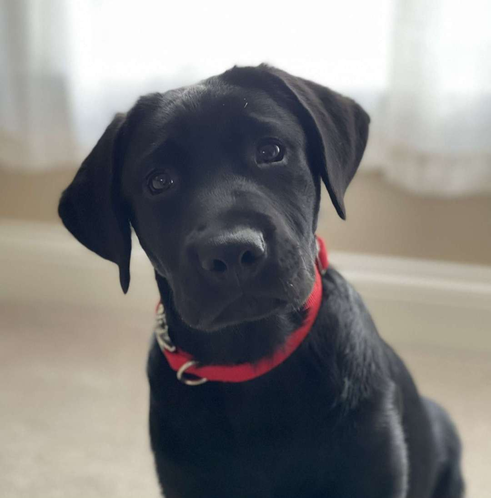

# **My Bootcamp Journey** 
## ***Week 1*** 

#### In my first week at bootcamp, I was expecting some nerves and confusion. However, once I got in and started learning with the other bootcampers, I felt more confortable and excited for the upcoming months. I'm excited to learn more about Git, and from what I have heard from my peers, I am looking forward to studying javascript. One thing you could learn about me from reading this blog is I have a 1 year old black lab named Sokka. 


```
Highlights of week 1:
I got to meet and learn about my fellow bootcampers
I learned about Git and GitHub
I learned how to use a few of git's commands
I learned how to create a repository and push and pull files
I had some challenges trying to set up Git and Github and was able to overcome them
```

#### A few commands I learned in Git:
 - git --version
 - git status
 - git init
 - git add
 - git commit
 - git pull
 - git checkout
 - touch

### Code Snippet
This is some JavaScript code from my final project during the Awesome Inc Intro to Web class.
```
// this const sets up the joke text
const jokeResult = document.getElementById("jokeResult");

// this const sets up the joke button
const jokeButton = document.getElementById("jokeButton");
jokeButton.addEventListener("click", getData);

// this fuction calls the api and creates an h1 with innertext
async function getData(e) {
  const response = await fetch(
    "https://v2.jokeapi.dev/joke/Programming?blacklistFlags=nsfw,religious,political,racist,sexist,explicit&type=single"
  );
  const data = await response.json();
  const theJoke = document.createElement("h1");
  jokeResult.innerText = data.joke;
  jokeResult.append(theJoke); // this adds the text to the h1 // appneds to html
  ```

